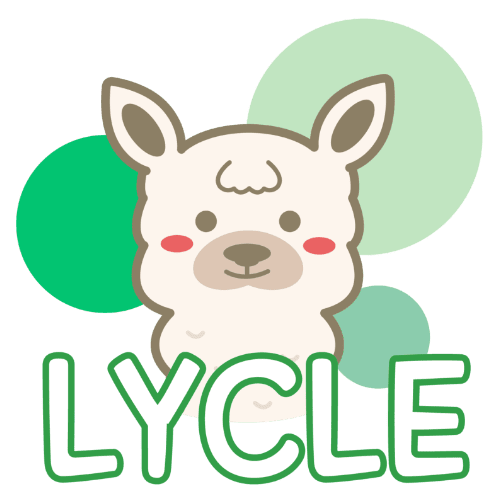
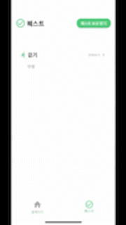

# Lycle - 블록체인 기반 일상생활 동기부여 서비스

<div align="center">

</div>

## 프로젝트 영상
<a href="https://youtu.be/00eHynewKS8">파란학기 LYCLE팀 성과 발표</a> (모바일 시연영상 1분 42초 ~ 2분 54초)

## 프로젝트 소개
**Lycle은 사용자가 건강한 일상생활을 할 수 있도록 소소한 동기부여를 제공하는 것이 목표인 블록체인 서비스입니다.**

### 개발 배경
+ **작심삼일은 이제 그만!**

    미라클 모닝, 운동, 다이어트 같은 것은 항상 굳게 마음을 먹지만, 시작한지 얼마 안 가 그만두는 경우가 많습니다. 이러한 종류의 다짐은 즉각적인 보상이나 효과가 없기 때문이라고 생각합니다.


+ **건강하게 살아보자**

    학교 공부, 과제, 프로젝트 등을 진행하면서 밤새는 경우가 잦아질 때면 생활 패턴이 꼬이곤 합니다. 그리고 컴퓨터를 다루는 IT 관련 학과 특성상 앉아만 있는 경우가 많습니다.

### 개발 목표
+ **Life to Earn, 일상생활에서 동기부여를 획득하자**

    오늘 하루 건강한 일상생활을 살았다면 그에 따른 즉각적인 보상을 얻을 수 있도록 하고자 합니다. 소소한 보상을 통해서 하루를 잘 살았다고 느끼게끔 하고자 합니다. 최종적으로 이러한 하루들이 모여, 처음 다짐했던 것을 성취할 수 있도록 하고자 합니다.


+ **다양하게 즐길 수 있는 건강 퀘스트**

  STEPN 같은 M2E 어플리케이션을 보면 걷기나 달리기를 통해서만 보상을 획득할 수 있습니다. 8시간 이상 잠자기, 이어폰 볼륨 적게 듣기 등 좀 더 다양하게 즐길 수 있는 콘텐츠를 준비하고자 합니다.

## 핵심 기능 소개

<table>
  <thead>
    <th align="center">
     <strong>
          <font style="vertical-align: inherit;">Metamask 연동</font>
     </strong>
    </th>
  </thead>
  <tbody>
    <tr>
      <td align="center">
        
      </td>
    </tr>
    <tr>
      <td>
        <strong>
        <font style="vertical-align: inherit;">Metamask 연동을 통해서 보유하고 있는 코인, NFT을 확인할 수 있습니다.</font>
        </strong>
      </td>
    </tr>
  </tbody>
</table>

<table>
  <thead>
    <th align="center">
     <strong>
          <font style="vertical-align: inherit;">Lycle NFT</font>
     </strong>
    </th>
  </thead>
  <tbody>
    <tr>
      <td align="center">
        
      </td>
    </tr>
    <tr>
      <td>
        <strong>
        <font style="vertical-align: inherit;">현재 보유하고 있는 Lycle NFT를 확인할 수 있습니다.</font>
        </strong>
      </td>
    </tr>
  </tbody>
</table>

<table>
  <thead>
    <th align="center">
     <strong>
          <font style="vertical-align: inherit;">건강 퀘스트 시스템</font>
     </strong>
    </th>
  </thead>
  <tbody>
    <tr>
      <td align="center">
        
      </td>
    </tr>
    <tr>
      <td>
        <strong>
        <font style="vertical-align: inherit;">원하는 건강 퀘스트를 시작한 뒤 완료하여 코인과 뱃지 NFT를 획득할 수 있습니다.</font>
        </strong>
      </td>
    </tr>
  </tbody>
</table>

## 기술 스택

+ **Flutter**

  Android, iOS를 동시에 지원하는 모바일 어플리케이션 개발에 용이한 크로스 플랫폼 프레임워크입니다.


+ **Bloc**

  Flutter의 상태 관리 라이브러리입니다. Presentation과 Business logic을 쉽게 분리할 수 있다는 장점이 있습니다. Lycle 프로젝트는 기기로부터 건강 데이터 스트림을 받아와 건강 퀘스트 시스템을 구성합니다. Bloc은 이러한 Stream을 통해 상태 관리를 하는 것에 적합한 이벤트 기반 구조입니다. 따라서 Bloc 라이브러리를 선택했습니다.


+ **Ethereum**

  Lycle NFT가 Lycle 웹 마켓플레이스 뿐만 아니라 OpenSea와 같은 가장 유명한 마켓플레이스에서도 활용할 수 있게끔 하고 싶었습니다. 이에 따라 블록체인 네트워크로 이더리움 네트워크를 선택했습니다.


+ **Web3dart**

  Dart 언어로 이더리움 네트워크와 통신할 수 있도록 도와주는 Web3 라이브러리 입니다.


+ **WalletConnect**

  WalletConnect는 DApp을 모바일 지갑에 연결할때 end-to-end 암호화를 사용하는 개방형 프로토콜입니다. 이 프로토콜을 사용해 MetaMask 지갑과의 세션 연결을 진행합니다. 이를 통해 사용자의 MetaMask를 활용할 수 있습니다.

## 폴더 구조

```sh
lib
├── main.dart
└── src
    ├── app.dart
    ├── bloc # Bloc을 모아놓은 폴더
    ├── constants # Color, Font, Regular expression 등 상수를 모아놓은 폴더
    ├── controller # ValueNotifier를 모아놓은 폴더
    ├── data # Repository layer와 Data layer를 모아놓은 폴더
    │   ├── api # API를 호출하는 Client class를 모아놓은 폴더
    │   ├── enum # Enum을 모아놓은 폴더
    │   ├── helper # 건강 데이터를 얻는 등 독립적인 기능을 하는 클래스를 모아놓은 폴더
    │   ├── model # Entity class를 모아놓은 폴더
    │   └── repository # Repository later
    ├── routes # Routing을 위한 폴더
    ├── ui # UI를 보여주기 위한 폴더
    └── utils # 간단한 함수나 Extension을 모아놓은 폴더
```

## 회고

https://elemental-button-97b.notion.site/Lycle-7c10018cbb834274b32ece5b969f0db6